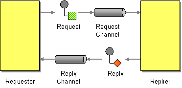

# Request Reply

Camel supports the [Request Reply](http://www.enterpriseintegrationpatterns.com/RequestReply.md) from the [EIP patterns](enterprise-integration-patterns.md).

When an application sends a message, how can it get a response from the receiver?



Send a pair of Request-Reply messages, each on its own channel.

Camel supports Request Reply by the [Exchange Pattern](../../../manual/exchange-pattern.md) on a [Message](message.md) which can be set to `InOut` to indicate a request/reply message. Camel [Components](../index.md) then implement this pattern using the underlying transport or protocols.

For example, when using [JMS](../jms-component.md) with `InOut` the component will by default perform these actions:

-   create by default a temporary inbound queue
    
-   set the `JMSReplyTo` destination on the request message
    
-   set the `JMSCorrelationID` on the request message
    
-   send the request message
    
-   consume the response and associate the inbound message to the belonging request using the `JMSCorrelationID` (as you may be performing many concurrent request/responses).
    
-   continue routing when the reply is received and populated on the [Exchange](../../../manual/exchange.md)
    

> **Tip**
> See the related [Event Message](event-message.md).

## Using endpoint URI

If you are using a component which defaults to `InOnly` you can override the [Exchange Pattern](../../../manual/exchange-pattern.md) for a **consumer** endpoint using the pattern property.

```text
foo:bar?exchangePattern=InOut
```

> **Important**
> This is only possible on endpoints used by consumers (i.e., in `<from>`).

In the example below the message will be forced as a request reply message as the consumer is in `InOut` mode.

-   Java
    
-   XML
    
-   YAML
    

```java
from("jms:someQueue?exchangePattern=InOut")
  .to("bean:processMessage");
```

```xml
<route>
    <from uri="jms:someQueue?exchangePattern=InOut"/>
    <to uri="bean:processMessage"/>
</route>
```

```yaml
- route:
    from:
      uri: jms:someQueue?exchangePattern=InOut
      steps:
        - to:
            uri: bean:processMessage
```

## Using setExchangePattern EIP

You can specify the [Exchange Pattern](../../../manual/exchange-pattern.md) using `setExchangePattern` in the DSL.

-   Java
    
-   XML
    
-   YAML
    

```java
from("direct:foo")
  .setExchangePattern(ExchangePattern.InOut)
  .to("jms:queue:cheese");
```

```xml
<route>
    <from uri="direct:foo"/>
    <setExchangePattern pattern="InOut"/>
    <to uri="jms:queue:cheese"/>
</route>
```

```yaml
- route:
    from:
      uri: direct:foo
      steps:
        - setExchangePattern:
            pattern: InOut
        - to:
            uri: jms:queue:cheese
```

When using `setExchangePattern` then the [Exchange Pattern](../../../manual/exchange-pattern.md) on the [Exchange](../../../manual/exchange.md) is changed from this point onwards in the route.

This means you can change the pattern back again at a later point:

-   Java
    
-   XML
    
-   YAML
    

```java
from("direct:foo")
  .setExchangePattern(ExchangePattern.InOnly)
  .to("jms:queue:one-way")
  .setExchangePattern(ExchangePattern.InOut)
  .to("jms:queue:in-and-out")
  .log("InOut MEP received ${body}");
```

```xml
    <route>
        <from uri="direct:foo"/>
        <setExchangePattern pattern="InOnly"/>
        <to uri="jms:queue:one-way"/>
        <setExchangePattern pattern="InOut"/>
        <to uri="jms:queue:in-and-out"/>
        <log message="InOut MEP received ${body}"/>
    </route>
```

```yaml
- route:
    from:
      uri: direct:foo
      steps:
        - setExchangePattern:
            pattern: InOnly
        - to:
            uri: jms:queue:one-way
        - setExchangePattern:
            pattern: InOut
        - to:
            uri: jms:queue:in-and-out
        - log:
            message: "InOut MEP received ${body}"
```

> **Note**
> Using `setExchangePattern` to change the [Exchange Pattern](../../../manual/exchange-pattern.md) is often only used in special use-cases where you must force to be using either `InOnly` or `InOut` mode when using components that support both modes (such as messaging components like ActiveMQ, JMS, RabbitMQ etc.)

## JMS component and InOnly vs. InOut

When consuming messages from [JMS](../jms-component.md) a Request Reply is indicated by the presence of the `JMSReplyTo` header. This means the JMS component automatic detects whether to use `InOnly` or `InOut` in the consumer.

Likewise, the JMS producer will check the current [Exchange Pattern](../../../manual/exchange-pattern.md) on the [Exchange](../../../manual/exchange.md) to know whether to use `InOnly` or `InOut` mode (i.e., one-way vs. request/reply messaging)