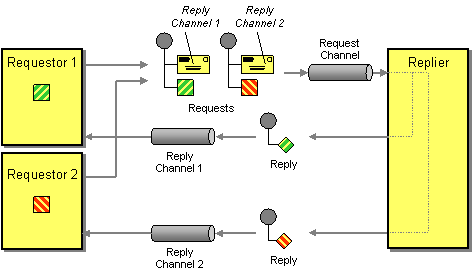

# Return Address

Camel supports the [Return Address](http://www.enterpriseintegrationpatterns.com/ReturnAddress.md) from the [EIP patterns](enterprise-integration-patterns.md).

How does a replier know where to send the reply?



The request message should contain a Return Address that indicates where to send the reply message.

Camel supports Return Address by messaging [Components](../index.md) that provides this functionality such as the [JMS](../jms-component.md) component via the `JMSReplyTo` header.

## Example

In the example below we send a message to the JMS cheese queue using `InOut` mode, this means that Camel will automatically configure the `JMSReplyTo` header with a temporary queue as the Return Address.

-   Java
    
-   XML
    
-   YAML
    

```java
from("direct:foo")
  .to(ExchangePattern.InOut, "jms:queue:cheese");
```

```xml
<route>
    <from uri="direct:foo"/>
    <to pattern="InOut" uri="jms:queue:cheese"/>
</route>
```

```yaml
- route:
    from:
      uri: direct:foo
      steps:
        - to:
            uri: jms:queue:cheese
            pattern: InOut
```

You can also specify a named reply queue with the `replyTo` option (instead of a temporary queue). When doing so then `InOut` mode is implied:

-   Java
    
-   XML
    
-   YAML
    

```java
from("direct:foo")
  .to("jms:queue:cheese?replyTo=myReplyQueue");
```

```xml
<route>
    <from uri="direct:foo"/>
    <to uri="jms:queue:cheese?replyTo=myReplyQueue"/>
</route>
```

```yaml
- route:
    from:
      uri: direct:foo
      steps:
        - to:
            uri: jms:queue:cheese?replyTo=myReplyQueue
```

## See Also

See the related [Request Reply](requestReply-eip.md) EIP.