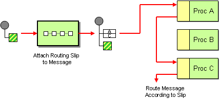

# Routing Slip

Camel supports the [Routing Slip](https://www.enterpriseintegrationpatterns.com/patterns/messaging/RoutingTable.md) from the [EIP patterns](enterprise-integration-patterns.md).

How do we route a message consecutively through a series of processing steps when the sequence of steps is not known at design-time and may vary for each message?



Attach a Routing Slip to each message, specifying the sequence of processing steps. Wrap each component with a special message router that reads the Routing Slip and routes the message to the next component in the list.

## Options

The Routing Slip eip supports the following options which are listed below.

   
| Name | Description | Default | Type |
| --- | --- | --- | --- |
| **note** | The note for this node. |  | String |
| **description** | The description for this node. |  | String |
| **disabled** | Whether to disable this EIP from the route during build time. Once an EIP has been disabled then it cannot be enabled later at runtime. | false | Boolean |
| **expression** | **Required** The expression to compute the routing slip of endpoint URIs. The result is a delimited list of endpoint URIs that defines the series of processing steps. |  | ExpressionDefinition |
| **uriDelimiter** | The delimiter used to separate endpoint URIs in the routing slip expression. Default is comma. | , | String |
| **ignoreInvalidEndpoints** | If enabled then invalid endpoint URIs are ignored and logged instead of throwing an exception. | false | Boolean |
| **cacheSize** | Configures the cache size for ProducerCache which caches producers for reuse. The default cache size is 1000. Set to -1 to turn off caching. |  | Integer |
> **Tip**
> See the `cacheSize` option for more details on _how much cache_ to use depending on how many or few unique endpoints are used.

## Exchange properties

The Routing Slip eip supports the following exchange properties which are listed below.

The exchange properties are set on the `Exchange` by the EIP, unless otherwise specified in the description. This means those properties are available after this EIP has completed processing the `Exchange`.

   
| Name | Description | Default | Type |
| --- | --- | --- | --- |
| **CamelSlipEndpoint** | The endpoint uri of this routing slip. |  | String |
| **CamelToEndpoint** | Endpoint URI where this Exchange is being sent to. |  | String |

## Using Routing Slip

The Routing Slip EIP allows to route a message through a series of [endpoints](../../../manual/endpoint.md) (the slip).

There can be 1 or more endpoint [uris](../../../manual/uris.md) in the slip.

> **Tip**
> A slip can be empty, meaning that the message will not be routed anywhere.

The following route will take any messages sent to the Apache ActiveMQ queue cheese and use the header with key "whereTo" that is used to compute the slip (endpoint [uris](../../../manual/uris.md)).

-   Java
    
-   XML
    
-   YAML
    

```java
from("activemq:cheese")
  .routingSlip(header("whereTo"));
```

```xml
<route>
  <from uri="activemq:cheese"/>
  <routingSlip>
    <header>whereTo</header>
  </routingSlip>
</route>
```

```yaml
- route:
    from:
      uri: activemq:cheese
      steps:
        - routingSlip:
            expression:
              header:
                expression: whereTo
```

The value of the header ("whereTo") should be a comma-delimited string of endpoint URIs you wish the message to be routed to. The message will be routed in a [pipeline](pipeline-eip.md) fashion, i.e., one after the other.

The Routing Slip sets a property, `Exchange.SLIP_ENDPOINT`, on the `Exchange` which contains the current endpoint as it advanced though the slip. This allows you to _know_ how far we have processed in the slip.

The Routing Slip will compute the slip **beforehand**, which means the slip is only computed once. If you need to compute the slip _on-the-fly_, then use the [Dynamic Router](dynamicRouter-eip.md) EIP instead.

### How is the slip computed

The Routing Slip uses an [Expression](../../../manual/expression.md) to compute the value for the slip. The result of the expression can be one of:

-   `String`
    
-   `Collection`
    
-   `Iterator` or `Iterable`
    
-   Array
    

If the value is a `String` then the `uriDelimiter` is used to split the string into multiple uris. The default delimiter is comma, but can be re-configured.

### Ignore Invalid Endpoints

The Routing Slip supports `ignoreInvalidEndpoints` (like [Recipient List](recipientList-eip.md) EIP). You can use it to skip endpoints which are invalid.

-   Java
    
-   XML
    
-   YAML
    

```java
from("direct:start")
  .routingSlip(header("myHeader")).ignoreInvalidEndpoints();
```

```xml
<route>
  <from uri="direct:start"/>
  <routingSlip ignoreInvalidEndpoints="true">
    <header>myHeader</header>
  </routingSlip>
</route>
```

```yaml
- route:
    from:
      uri: direct:start
      steps:
        - routingSlip:
            ignoreInvalidEndpoints: "true"
            expression:
              header:
                expression: myHeader
```

Then let us say the `myHeader` contains the following two endpoints `direct:foo,xxx:bar`. The first endpoint is valid and works. However, the second one is invalid and will just be ignored. Camel logs at DEBUG level about it, so you can see why the endpoint was invalid.