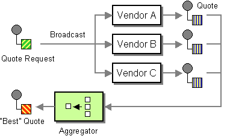

# Scatter-Gather

Camel supports the [Scatter-Gather](https://www.enterpriseintegrationpatterns.com/patterns/messaging/BroadcastAggregate.md) from the [EIP patterns](enterprise-integration-patterns.md) book.

The Scatter-Gather from the EIP patterns allows you to route messages to a number of dynamically specified recipients and re-aggregate the responses back into a single message.



In Camel, the Scatter-Gather EIP is supported in two different synchronous modes.

-   request/reply mode, where the re-aggregated response message continues being routed synchronously after the Scatter-Gather is complete.
    
-   one-way mode, where the response message is being routed asynchronous separately from the incoming message thread.
    

## Request/Reply vs. One-Way messaging modes

In Camel, the request/reply mode is done by using only the [Recipient List](recipientList-eip.md) which comes with aggregation built-in (which is often the simplest solution).

The request/reply mode refers to the fact that the response message is tied synchronously to the incoming message (that would wait) until the response message is ready, and then continue being routed. This allows for [Request Reply](requestReply-eip.md) messaging style.

The one-way mode refers to the fact that the response message is not tied to the incoming message (which will continue). And the response message (when its ready) will continue being routed independently of the incoming message. This only allows for [Event Message](event-message.md) messaging style.

In the one-way mode, then you combine the [Recipient List](recipientList-eip.md) and [Aggregate](aggregate-eip.md) EIPs together as the Scatter-Gather EIP solution.

## Using Recipient List only

In the following example, we want to call two HTTP services and gather their responses into a single message, as the response:

-   Java
    
-   XML
    
-   YAML
    

```java
from("servlet:cheese")
    .recipientList(constant("http:server1,http:server2")).aggregationStrategy("cheeseAggregator")
    .to("log:response");
```

```xml
<route>
    <from uri="servlet:cheese"/>
        <recipientList aggregationStrategy="cheeseAggregator">
            <constant>http:server1,http:server2</constant>
        </recipientList>
    <to uri="log:response"/>
</route>
```

```yaml
- route:
    from:
      uri: servlet:cheese
      steps:
        - recipientList:
            aggregationStrategy: cheeseAggregator
            expression:
              constant:
                expression: "http:server1,http:server2"
        - to:
            uri: log:response
```

This is a basic example that only uses basic functionality of the [Recipient List](recipientList-eip.md). For more details on how the aggregation works, see the [Recipient List](recipientList-eip.md) documentation.

## Using Recipient List and Aggregate EIP

In this example, we want to get the best quote for beer from several vendors.

We use [Recipient List](recipientList-eip.md) to get the request for a quote to all vendors and an [Aggregate](aggregate-eip.md) to pick the best quote out of all the responses.

The routes for this are defined as:

Java

```java
from("direct:start")
    .recipientList(header("listOfVendors"));

from("seda:quoteAggregator")
     .aggregate(header("quoteRequestId"))
        .aggregationStrategy("beerAggregator")
        .completionTimeout(1000)
        .to("direct:bestBeer")
    .end();
```

```xml
  <route>
    <from uri="direct:start"/>
    <recipientList>
      <header>listOfVendors</header>
    </recipientList>
  </route>

  <route>
    <from uri="seda:quoteAggregator"/>
    <aggregate aggregationStrategy="beerAggregator" completionTimeout="1000">
      <correlationExpression>
        <header>quoteRequestId</header>
      </correlationExpression>
      <to uri="direct:bestBeer"/>
    </aggregate>
  </route>
```

YAML

```yaml
- route:
    from:
      uri: direct:start
      steps:
        - recipientList:
            expression:
              header:
                expression: listOfVendors
- route:
    from:
      uri: seda:quoteAggregator
      steps:
        - aggregate:
            aggregationStrategy: beerAggregator
            completionTimeout: 1000
            correlationExpression:
              header:
                expression: quoteRequestId
            steps:
              - to:
                  uri: direct:bestBeer
```

So in the first route, you see that the [Recipient List](recipientList-eip.md) is looking at the listOfVendors header for the list of recipients. So, we need to send a message like:

```java
Map<String, Object> headers = new HashMap<>();
headers.put("listOfVendors", "bean:vendor1,bean:vendor2,bean:vendor3");
headers.put("quoteRequestId", "quoteRequest-1");

template.sendBodyAndHeaders("direct:start", "<quote_request item=\"beer\"/>", headers);
```

This message will be distributed to the following Endpoints: bean:vendor1, bean:vendor2, and bean:vendor3. These are all Java beans (called via the Camel [Bean](../../4.18.x/bean-component.md) endpoint), which look like:

```java
public class MyVendor {
    private int beerPrice;

    @Produce("seda:quoteAggregator")
    private ProducerTemplate quoteAggregator;

    public MyVendor(int beerPrice) {
        this.beerPrice = beerPrice;
    }

    public void quote(@XPath("/quote_request/@item") String item, Exchange exchange) {
        if ("beer".equals(item)) {
            exchange.getMessage().setBody(beerPrice);
            quoteAggregator.send(exchange);
        } else {
            // ignore no quote
        }
    }
}
```

And are loaded up in Spring XML like this:

```xml
<camelContext>

    <bean id="aggregatorStrategy" class="org.apache.camel.spring.processor.scattergather.LowestQuoteAggregationStrategy"/>

    <bean id="vendor1" class="org.apache.camel.spring.processor.scattergather.MyVendor">
      <constructor-arg><value>1</value></constructor-arg>
    </bean>

    <bean id="vendor2" class="org.apache.camel.spring.processor.scattergather.MyVendor">
      <constructor-arg><value>2</value></constructor-arg>
    </bean>

    <bean id="vendor3" class="org.apache.camel.spring.processor.scattergather.MyVendor">
      <constructor-arg><value>3</value></constructor-arg>
    </bean>

</camelContext>
```

Each bean is loaded with a different price for beer. When the message is sent to each bean endpoint, it will arrive at the `MyVendor.quote` method. This method does a simple check whether this quote request is for beer and then sets the price of beer on the exchange for retrieval at a later step. The message is forwarded on to the next step using [POJO Producing](../../../manual/pojo-producing.md) (see the `@Produce` annotation).

At the next step, we want to take the beer quotes from all vendors and find out which one was the best (i.e., the lowest!). To do this, we use the [Aggregate](aggregate-eip.md) EIP with a custom `AggregationStrategy`.

The [Aggregate](aggregate-eip.md) needs to be able to compare only the messages from this particular quote; this is easily done by specifying a correlation expression equal to the value of the quoteRequestId header. As shown above in the message sending snippet, we set this header to quoteRequest-1. This correlation value must be unique, or you may include responses that are not part of this quote. To pick the lowest quote out of the set, we use a custom `AggregationStrategy` like:

```java
public class LowestQuoteAggregationStrategy implements AggregationStrategy {

    public Exchange aggregate(Exchange oldExchange, Exchange newExchange) {
        // the first time we only have the new exchange
        if (oldExchange == null) {
            return newExchange;
        }

        if (oldExchange.getMessage().getBody(int.class) < newExchange.getMessage().getBody(int.class)) {
            return oldExchange;
        } else {
            return newExchange;
        }
    }
}
```

And finally, the aggregator will assemble the response message with the best beer price (the lowest). Notice how the aggregator has timeout built-in, meaning that if one or more of the beer vendors does not respond, then the aggregator will discard those _late_ responses, and send out a message with the _best price so far_.

The message is then continued to another route via the `direct:bestBeer` endpoint.

## See Also

The Scatter-Gather EIP is a composite pattern built by exiting EIPs:

-   [Recipient List](recipientList-eip.md)
    
-   [Aggregate](aggregate-eip.md)