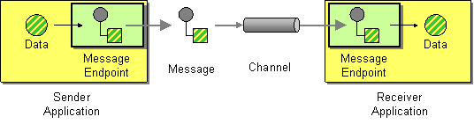

# To D

Camel supports the [Message Endpoint](http://www.enterpriseintegrationpatterns.com/MessageEndpoint.md) from the [EIP patterns](enterprise-integration-patterns.md) using the [Endpoint](https://www.javadoc.io/doc/org.apache.camel/camel-api/current/org/apache/camel/Endpoint.md) interface.

How does an application connect to a messaging channel to send and receive messages?



Connect an application to a messaging channel using a Message Endpoint, a client of the messaging system that the application can then use to send or receive messages.

In Camel the ToD EIP is used for sending [messages](message.md) to dynamic [endpoints](message-endpoint.md).

The [To](to-eip.md) and ToD EIPs are the most common patterns to use in Camel [routes](../../../manual/routes.md).

## Options

The To D eip supports the following options which are listed below.

   
| Name | Description | Default | Type |
| --- | --- | --- | --- |
| **note** | The note for this node. |  | String |
| **description** | The description for this node. |  | String |
| **disabled** | Whether to disable this EIP from the route during build time. Once an EIP has been disabled then it cannot be enabled later at runtime. | false | Boolean |
| **uri** | **Required** The uri of the endpoint to send to. The uri can be dynamic computed using the simple language. |  | String |
| **variableSend** | To use a variable as the source for the message body to send. This makes it handy to use variables for user data and to easily control what data to use for sending and receiving. |  | String |
| **variableReceive** | To use a variable to store the received message body (only body, not headers). This makes it handy to use variables for user data and to easily control what data to use for sending and receiving. |  | String |
| **pattern** | 
Sets the optional ExchangePattern used to invoke this endpoint.

Enum values:

-   InOnly
    
-   InOut
    


 |  | ExchangePattern |
| **cacheSize** | Sets the maximum size used by the ProducerCache which is used to cache and reuse producers when uris are reused. Use 0 for default cache size, or -1 to turn cache off. |  | Integer |
| **ignoreInvalidEndpoint** | Whether to ignore invalid endpoint URIs and skip sending the message. | false | Boolean |
| **allowOptimisedComponents** | Whether to allow components to optimise toD if they are SendDynamicAware. | true | Boolean |
| **autoStartComponents** | Whether to auto startup components when toD is starting up. | true | Boolean |

## Exchange properties

The To D eip supports the following exchange properties which are listed below.

The exchange properties are set on the `Exchange` by the EIP, unless otherwise specified in the description. This means those properties are available after this EIP has completed processing the `Exchange`.

   
| Name | Description | Default | Type |
| --- | --- | --- | --- |
| **CamelToEndpoint** | Endpoint URI where this Exchange is being sent to. |  | String |

## Different between To and ToD

The `to` is used for sending messages to a static [endpoint](message-endpoint.md). In other words `to` sends messages only to the **same** endpoint.

The `toD` is used for sending messages to a dynamic [endpoint](message-endpoint.md). The dynamic endpoint is evaluated _on-demand_ by an [Expression](../../../manual/expression.md). By default, the [Simple](../languages/simple-language.md) expression is used to compute the dynamic endpoint URI.

## Using ToD

For example, to send a message to an endpoint which is dynamically determined by a [message header](message.md), you can do as shown below:

-   Java
    
-   XML
    
-   YAML
    

```java
from("direct:start")
  .toD("${header.foo}");
```

```xml
<route>
  <from uri="direct:start"/>
  <toD uri="${header.foo}"/>
</route>
```

```yaml
- route:
    from:
      uri: direct:start
      steps:
        - toD:
            uri: "${header.foo}"
```

You can also prefix the uri with a value because the endpoint [URI](../../../manual/uris.md) is evaluated using the [Simple](../languages/simple-language.md) language:

-   Java
    
-   XML
    
-   YAML
    

```java
from("direct:start")
  .toD("mock:${header.foo}");
```

```xml
<route>
  <from uri="direct:start"/>
  <toD uri="mock:${header.foo}"/>
</route>
```

```yaml
- route:
    from:
      uri: direct:start
      steps:
        - toD:
            uri: "mock:${header.foo}"
```

In the example above, we compute the dynamic endpoint with a prefix "mock:" and then the header foo is appended. So, for example, if the header foo has value order, then the endpoint is computed as "mock:order".

### Using other languages with toD

You can also use other languages such as [XPath](../languages/xpath-language.md). Doing this requires starting with `language:` as shown below. If you do not specify `language:` then the endpoint is a component name. And in some cases, there is both a component and language with the same name such as xquery.

-   Java
    
-   XML
    
-   YAML
    

```java
from("direct:start")
  .toD("language:xpath:/order/@uri");
```

```xml
<route>
  <from uri="direct:start"/>
  <toD uri="language:xpath:/order/@uri"/>
</route>
```

```yaml
- route:
    from:
      uri: direct:start
      steps:
        - toD:
            uri: language:xpath:/order/@uri
```

### Avoid creating endless dynamic endpoints that take up resources

When using dynamic computed endpoints with `toD` then you may compute a lot of dynamic endpoints, which results in an overhead of resources in use, by each dynamic endpoint uri, and its associated producer.

For example, HTTP-based endpoints where you may have dynamic values in URI parameters when calling the HTTP service, such as:

-   Java
    
-   XML
    
-   YAML
    

```java
from("direct:login")
  .toD("http:myloginserver:8080/login?userid=${header.userName}");
```

```xml
<route>
  <from uri="direct:login"/>
  <toD uri="http:myloginserver:8080/login?userid=${header.userName}"/>
</route>
```

```yaml
- route:
    from:
      uri: direct:login
      steps:
        - toD:
            uri: http:myloginserver:8080/login
            parameters:
              userid: "${header.userName}"
```

In the example above then the parameter `userid` is dynamically computed, and would result in one instance of endpoint and producer for each different userid. To avoid having too many dynamic endpoints you can configure `toD` to reduce its cache size, for example, to use a cache size of 10:

-   Java
    
-   XML
    
-   YAML
    

```java
from("direct:login")
  .toD("http:myloginserver:8080/login?userid=${header.userName}", 10);
```

```xml
<route>
  <from uri="direct:login"/>
  <toD uri="http:myloginserver:8080/login?userid=${header.userName}" cacheSize="10"/>
</route>
```

```yaml
- route:
    from:
      uri: direct:login
      steps:
        - toD:
            uri: http:myloginserver:8080/login
            parameters:
              userid: "${header.userName}"
            cacheSize: 10
```

> **Important**
> this will only reduce the endpoint cache of the `toD` that has a chance of being reused in case a message is routed with the same `userName` header. Therefore, reducing the cache size will not solve the _endless dynamic endpoint_ problem. Instead, you should use static endpoints with `to` and provide the dynamic parts in Camel message headers (if possible).

#### Using static endpoints to avoid endless dynamic endpoints

In the example above then the parameter `userid` is dynamically computed, and would result in one instance of endpoint and producer for each different userid. To avoid having too dynamic endpoints, you use a single static endpoint and use headers to provide the dynamic parts:

-   Java
    
-   XML
    
-   YAML
    

```java
from("direct:login")
  .setHeader(Exchange.HTTP_PATH, constant("/login"))
  .setHeader(Exchange.HTTP_QUERY, simple("userid=${header.userName}"))
  .toD("http:myloginserver:8080");
```

```xml
<route>
    <from uri="direct:login"/>
    <setHeader name="CamelHttpPath">
        <constant>/login</constant>
    </setHeader>
    <setHeader name="CamelHttpQuery">
        <simple>userid=${header.userName}</simple>
    </setHeader>
    <toD uri="http:myloginserver:8080"/>
</route>
```

```yaml
- route:
    from:
      uri: direct:login
      steps:
        - setHeader:
            name: CamelHttpPath
            expression:
              constant:
                expression: /login
        - setHeader:
            name: CamelHttpQuery
            expression:
              simple:
                expression: "userid=${header.userName}"
        - toD:
            uri: http:myloginserver:8080
```

However, you can use optimized components for `toD` that can _solve_ this out of the box, as documented next.

### Using optimized components with toD

A better solution would be if the HTTP component could be optimized to handle the variations of dynamic computed endpoint uris. This is with among the following components, which have been optimized for `toD`:

-   camel-http
    
-   camel-jetty
    
-   camel-netty-http
    
-   camel-undertow
    
-   camel-vertx-http
    

A number of non-HTTP components has been optimized as well:

-   camel-activemq
    
-   camel-amqp
    
-   camel-azure-files
    
-   camel-caffeine
    
-   camel-dynamic-router
    
-   camel-file
    
-   camel-ftp
    
-   camel-jms
    
-   camel-kafka
    
-   camel-paho-mqtt5
    
-   camel-paho
    
-   camel-sjms
    
-   camel-sjms2
    
-   camel-smb
    
-   camel-spring-rabbitmq
    

For the optimization to work, then:

1.  The optimization is detected and activated during startup of the Camel routes with `toD`.
    
2.  The dynamic uri in `toD` must provide the component name as either static or resolved via [property placeholders](../../../manual/using-propertyplaceholder.md).
    
3.  The supported components must be on the classpath.
    

The HTTP based components will be optimized to use the same hostname:port for each endpoint, and the dynamic values for context-path and query parameters will be provided as headers:

For example, this route:

-   Java
    
-   XML
    
-   YAML
    

```java
from("direct:login")
  .toD("http:myloginserver:8080/login?userid=${header.userName}");
```

```xml
<route>
    <from uri="direct:login"/>
    <toD uri="http:myloginserver:8080/login?userid=${header.userName}"/>
</route>
```

```yaml
- route:
    from:
      uri: direct:login
      steps:
        - toD:
            uri: http:myloginserver:8080/login
            parameters:
              userid: "${header.userName}"
```

This will essentially be optimized to (**internally** pseudo route):

_Java-only: pseudo code showing the internal optimization_

```java
from("direct:login")
  .setHeader(Exchange.HTTP_PATH, expression("/login"))
  .setHeader(Exchange.HTTP_QUERY, expression("userid=${header.userName}"))
  .toD("http:myloginserver:8080")
  .removeHeader(Exchange.HTTP_PATH)
  .removeHeader(Exchange.HTTP_QUERY);
```

Where _expression_ will be evaluated dynamically. Notice how the uri in `toD` is now static (`http:myloginserver:8080`). This optimization allows Camel to reuse the same endpoint and its associated producer for all dynamic variations. This yields much lower resource overhead as the same http producer will be used for all the different variations of `userids`.

> **Note**
> When the optimized component is in use, then you cannot use the headers `Exchange.HTTP_PATH` and `Exchange.HTTP_QUERY` to provide dynamic values to override the uri in `toD`. If you want to use these headers, then use the plain `to` DSL instead. In other words these headers are used internally by `toD` to carry the dynamic details of the endpoint.

In case of problems then you can turn on `DEBUG` logging level on `org.apache.camel.processor.SendDynamicProcessor` which will log during startup if `toD` was optimized, or if there was a failure loading the optimized component, with a stacktrace logged.

```text
Detected SendDynamicAware component: http optimising toD: http:myloginserver:8080/login?userid=${header.userName}
```