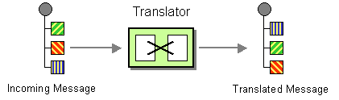

# Transform Data Type

Camel supports the [Message Translator](http://www.enterpriseintegrationpatterns.com/MessageTranslator.md) from the [EIP patterns](enterprise-integration-patterns.md).

How can systems using different data formats communicate with each other using messaging?



Use a special filter, a Message Translator, between other filters or applications to translate one data format into another.

The [Message Translator](message-translator.md) can be done in different ways in Camel:

-   Using [Transform](transform-eip.md) or [Set Body](setBody-eip.md) in the DSL
    
-   Calling a [Processor](../../../manual/processor.md) or [bean](../../../manual/bean-integration.md) to perform the transformation
    
-   Using template-based [Components](../index.md), with the template being the source for how the message is translated
    
-   Messages can also be transformed using [Data Format](../../../manual/data-format.md) to marshal and unmarshal messages in different encodings.
    
-   Using data type based transformation using [Transform DataType](#)
    

This page is documenting the last approach by using Transform Data Type EIP.

## Options

The Transform Data Type eip supports 0 options, which are listed below.

   
| Name | Description | Default | Type |
| --- | --- | --- | --- |
| **note** | Sets the note of this node. |  | String |
| **description** | Sets the description of this node. |  | String |
| **disabled** | Disables this EIP from the route. | false | Boolean |
| **fromType** | From type used in data type transformation. |  | String |
| **toType** | **Required** To type used as a target data type in the transformation. |  | String |

## Exchange properties

The Transform Data Type eip has no exchange properties.

## Using Transform DataType EIP

The [Transform DataType](#) references a given from/to data type (`org.apache.camel.spi.DataType`).

-   Java
    
-   XML
    
-   YAML
    

```java
from("direct:cheese")
    .transformDataType("myDataType")
    .to("log:hello");
```

```xml
<route>
    <from uri="direct:cheese"/>
    <transformDataType toType="myDataType"/>
    <to uri="log:hello"/>
</route>
```

```yaml
- route:
    from:
      uri: direct:cheese
      steps:
        - transformDataType:
            toType: myDataType
        - to:
            uri: log:hello
```

The example above defines the [Transform DataType](#) EIP that uses a target data type `myDataType`. The given data type may reference a [Transformer](../../../manual/transformer.md) that is able to handle the data type transformation.

> **Note**
> Users may also specify `fromType` in order to reference a very specific transformation from a given data type to a given data type.