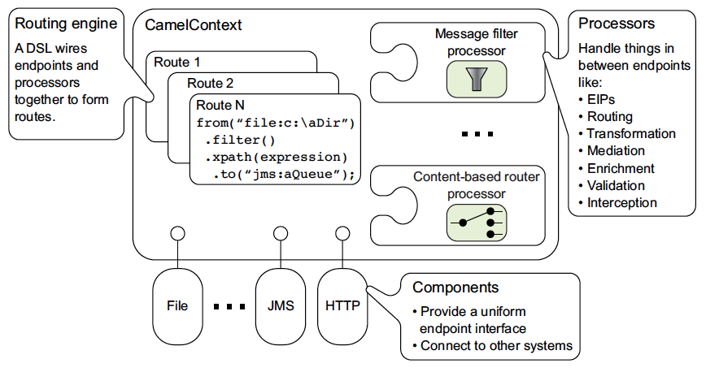

# Architecture

The following diagram shows a high-level view of the main concepts that make up Camel’s architecture.



At the center of the diagram you have the _heart_ of Apache Camel; the [CamelContext](camelcontext.md). The `CamelContext` is "Camel" …​ the runtime Camel, that contains and holds everything together.

[Routes](routes.md) are defined using one of Camel’s [DSLs](dsl.md). [Processors](processor.md) are used to transform and manipulate messages during routing as well as to implement all the [EIP](../components/4.22.x/eips/enterprise-integration-patterns.md)s, which have corresponding names in the DSLs. [Components](component.md) are the extension points in Camel for adding connectivity to other systems. To expose these systems to the rest of Camel, components provide an [endpoint](endpoint.md) interface.

## Routes 101

You use Camel for integration, and a key concept in Camel is [routes](routes.md) which tells Camel how messages should be routed between systems.

A route has exactly one input [endpoint](endpoint.md), and 0, 1 or more output [endpoints](endpoint.md).

You use Camel [DSL](dsl.md) to _code_ the [routes](routes.md). For example the route below can be coded in [Java DSL](java-dsl.md), [XML DSL](../components/4.22.x/others/java-xml-io-dsl.md), or [YAML DSL](../components/4.22.x/others/yaml-dsl.md):

-   Java
    
-   XML
    
-   YAML
    

```java
public class MyRoute extends RouteBuilder {

    public void configure() throws Exception {
        from("ftp:myserver/folder")
            .to("activemq:queue:cheese");
    }
}
```

```xml
<route>
    <from uri="ftp:myserver/folder"/>
    <to uri="activemq:queue:cheese"/>
</route>
```

```yaml
- route:
    from:
      uri: ftp:myserver/folder
      steps:
        - to:
            uri: activemq:queue:cheese
```