# Camel TUI Source Editor

The Source tab (**2**) of the [Camel TUI](camel-jbang-tui.md) is where you read and write your routes. It knows Camel: it checks your routes as you type, completes endpoint options from the Camel catalog, explains the line the cursor is on, and shows what each line of a running integration is doing. It works the same for YAML, Java and XML routes.

## Top Features

-   [**Live run data**](#_live_run_data) — the exchanges and failures of each line of the running integration, next to the code.
    
-   [**Problems as you type**](#_problems_as_you_type) — endpoint options, Simple expressions and more are checked as soon as a file opens and while you type, in YAML, Java and XML routes; a YAML or XML file with problems is not saved.
    
-   [**Quick fixes**](#_quick_fixes) — **Shift+F9** applies the fix a problem names, such as an option typo.
    
-   [**Fix with AI**](#_fix_with_ai) — **Shift+F8** asks the AI to fix the problem of a line; you confirm every change.
    
-   [**Completion**](#_completion) — **Tab** completes components, endpoint options and their values, Java DSL chains, XML elements and attributes, and simple expressions; light help for hand-written edits, see [Known limitations](#_known_limitations).
    
-   [**Quick documentation**](#_quick_documentation) — the documentation of the line the cursor is on, at the bottom, with the values of its property placeholders and where its bean is declared.
    
-   [**Navigation**](#_navigation) — jump between routes and to beans, see where an endpoint is used with **u**, find any node with **Ctrl+G**, see where the cursor is in the route.
    
-   [**Changes and diff**](#_changes_and_diff) — changed lines are marked, and **F7** shows the unsaved changes as a diff.
    
-   [**YAML, Java and XML**](#_yaml_java_and_xml) — **Space** shows a route in any of the three DSLs.
    

## Browsing and Editing

The left panel lists the files of the integration’s project, and the right panel shows the selected file with syntax highlighting. **Tab** switches between the two panels, and you can drag the border between them with the mouse.

Press **Enter** to view a file, or **F4** to edit it. The editor is a plain-text editor with helpers for Camel routes: undo and redo, moving and duplicating YAML blocks, smart **Home**, and word navigation. **Ctrl+R** opens a refactoring menu for the current line: replace the endpoint URI of the line, extract the value at the cursor to a property (the value goes to `application.properties`, in `src/main/resources` for a Maven layout, and a `{{key}}` placeholder takes its place), and extract a step to a new route file, called with `direct:` (YAML and XML routes). **Ctrl+S** saves and keeps editing, **F5** saves and closes, and **Esc** cancels (and asks before it discards unsaved changes). A running integration in dev mode reloads the saved file.

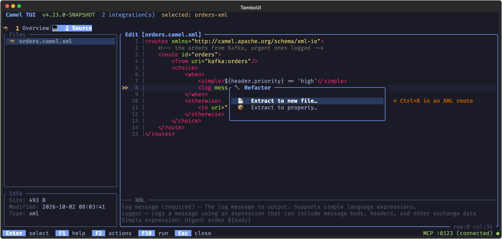

## Live Run Data

While the integration runs, a column after the line numbers shows what the processors on each line do: the exchanges they handled, and how many failed (`✗`, in red). The mean time is shown too, when it is 1 ms or more. The numbers follow the running integration, so the source reads as a heat map of the route: where the messages go, and where they fail.

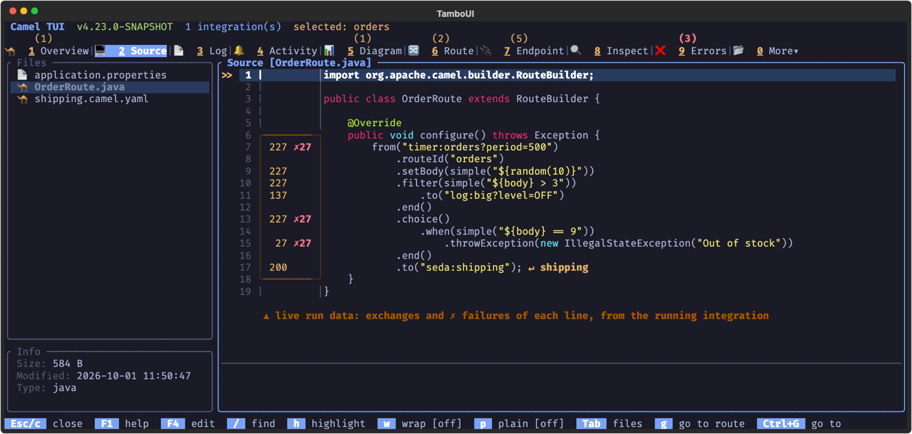

In the example the timer fired 227 times; the `filter` let 137 of those through to `log:big`, and 27 orders failed at `throwException`. You see this without leaving the code, and without adding a single log statement.

The column keeps its width, so the code does not move as the numbers grow. It works for YAML, Java and XML routes, as `camel run` records the source line of every processor.

## Problems as You Type

The editor checks your routes while you type: endpoint URIs and their options against the Camel catalog, Simple expressions, the YAML DSL schema, and a `to` whose URI holds `${...}` and should be a `toD`. Java routes are read without compiling them, so endpoints built with the endpoint DSL or from a constant are checked too.

The problems are marked as soon as a file opens, before you change anything: a red `✗` on the line, and the count in the title. The panel at the bottom says the problem of the selected line, and **F9** goes to the next one.

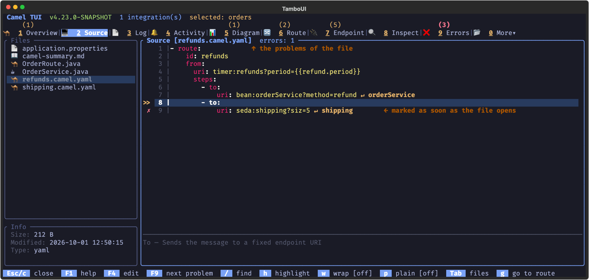

In the editor, a line with a problem has a red line number, the title shows how many errors there are, and the Error panel at the bottom says what is wrong with the line the cursor is on. They are checked again as you type, and **F9** jumps to the next problem.

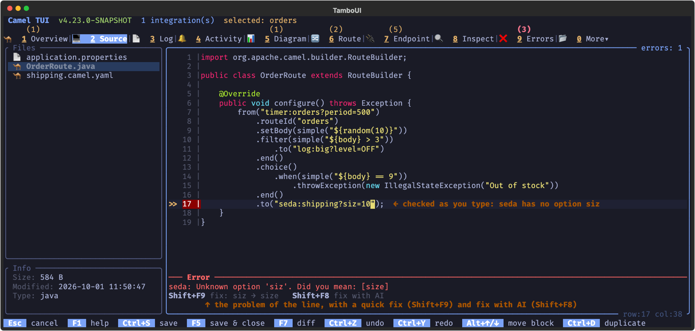

### Saving

When you save, the file is checked first. A YAML or XML file with problems is not saved, and the problems are shown in a popup:

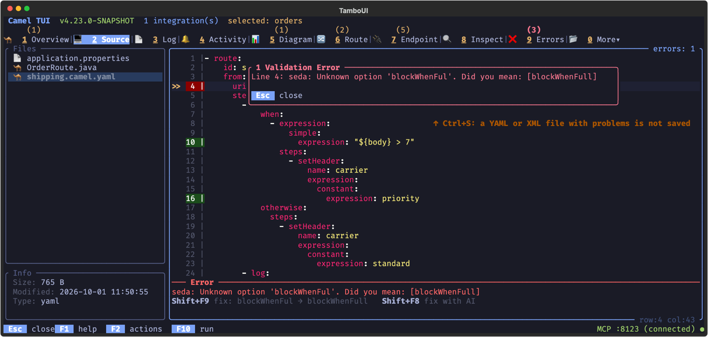

A Java file is saved anyway and its problems are reported: it is the application’s code, and a check cannot know everything a Java route computes at runtime.

The checks can be turned off in the Settings (**F2** > Settings).

## Quick Fixes

Many problems say how to fix them: an option typo (`siz` instead of `size`), an enum value a letter off, a `to` that should be a `toD`, `${key}` where the property placeholder `{{key}}` is meant, or a Simple function the error names the right one of (`${bdy}` for `${body}`). For these, the Error panel shows the fix, and **Shift+F9** applies it to the line:

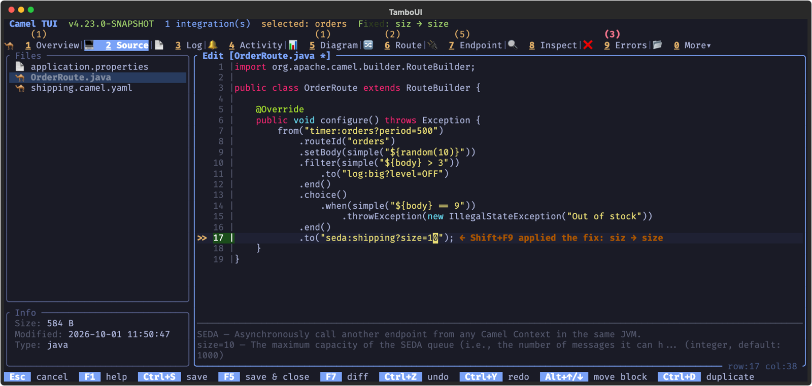

The same fixes are part of the result of the `camel_validate_source` MCP tool, so an AI agent can apply them too.

## Fix with AI

When a problem has no quick fix, **Shift+F8** asks the AI. The file is saved as it is, and the AI panel opens with the question already written: the file, the line, the problem, and how to fix it. Press **Enter** to send it, or change it first.

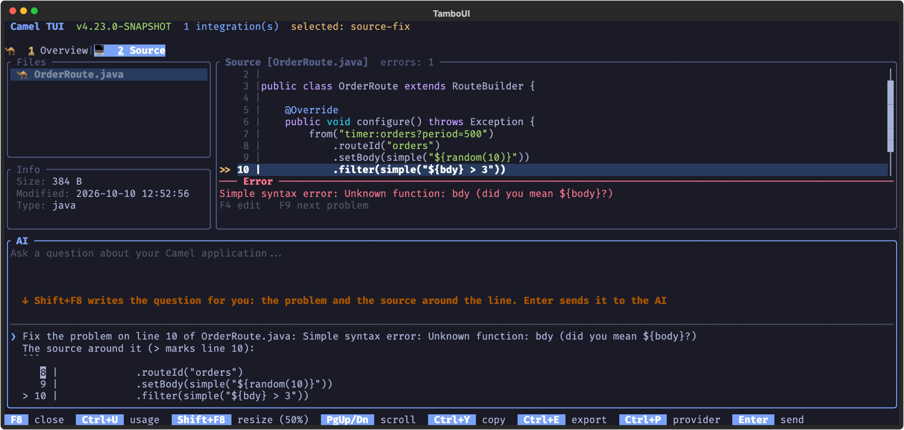

The AI changes the file with the same tools an AI agent uses over MCP, and every change waits for you: the dialog shows what the AI wants to change, **d** shows the diff, **Enter** applies it and **Esc** rejects it.

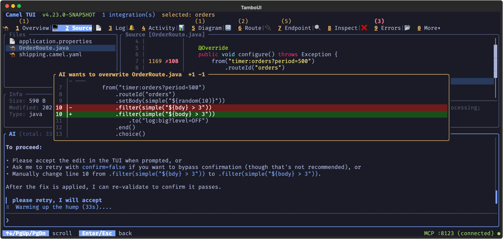

A file the AI writes is checked like one you save, and a write that brings new problems is refused, so the AI gets the problems back and can try again. The view shows the file as the AI wrote it as soon as you apply the change. With `/write live` in the AI panel, you can also watch the AI type its change in the editor; see [Watching the AI edit](camel-jbang-tui-ai-agents.html#_watching_the_ai_edit_live_mode).

The AI panel works with a hosted provider or with a local model through Ollama; see [Choosing an AI provider](camel-jbang-tui-ai.html#_choosing_an_ai_provider).

## Completion

In edit mode, **Tab** completes what the cursor is on. Type to filter the list (an exact or prefix match comes first), use **Up**/**Down** to choose, and **Enter** to accept. The details panel shows the documentation of the choice: its type, default value and description.

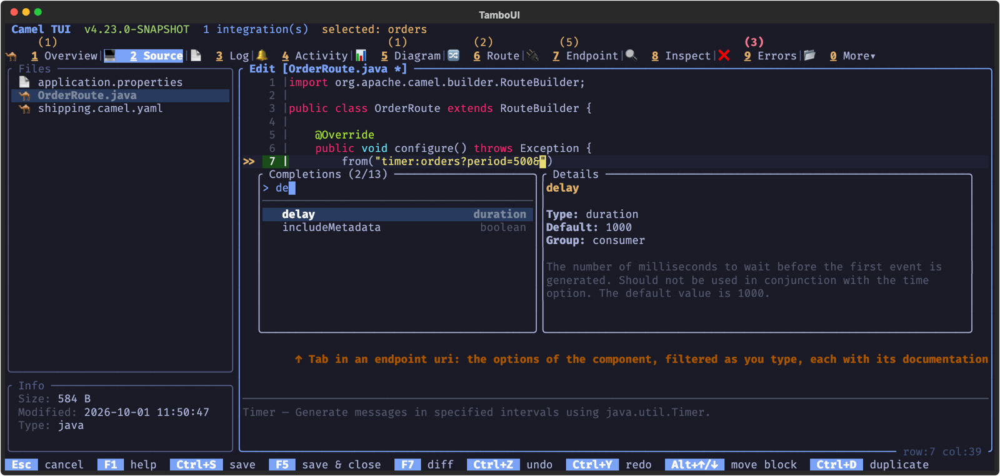

What can be completed:

-   **Java and XML routes** — in the endpoint URI of `from`, `to`, `toD`, `wireTap`, `enrich`, `pollEnrich` and `poll` (the string given to them in Java, their `uri` attribute in XML): the component name before the `:`, the endpoint options after `?` or `&` (consumer or producer options, depending on where the endpoint is, and without the ones already given), and the value of an option after `=`.
    
-   **Java routes** — after a dot in a route chain, the methods that compile there: first the options of the EIP the chain is on (after `.split(body())` the `parallelProcessing`, `streaming`…​ of the split), then the EIPs, and the `end()`, `endChoice()` or `endDoTry()` that closes the block you are in. The chain is followed from its `from` through its blocks, so after `.end()` the options of the split are gone again, and after `.split().` the languages of the expression come. The method goes in with its parentheses, the cursor inside them when it takes arguments (`.split(|)`). The documentation comes from the catalog. In an argument the chain of the argument is completed (`.filter(header("priority").` offers `isEqualTo`, `isNotNull`, `contains`…​), and so are the REST DSL (`rest("/api").get("/orders").`, with `param()` …​ `endParam()`), `restConfiguration()` and route templates.
    
-   **XML routes** — after `<`, or on an empty line, the elements that go inside the parent element (the EIPs of a route, `when` and `otherwise` in a `choice`, the languages where an expression goes, and once it has one, no other). The chosen element is inserted with its required attributes and its end tag (`<to uri=""/>`, `<split></split>`), the cursor where you go on. In a start tag the attributes of the element (the required ones first, without the ones already given), in an attribute its values. The structure and documentation come from the XML schema of the catalog, so they follow the Camel version of the project.
    
-   **YAML routes** — EIP names, component names (only the components that can consume on a `from`, and produce on a `to`), endpoint options in a `parameters:` block (the required ones first), EIP options, and option values.
    
-   **Simple expressions**, in YAML, Java and XML routes alike — after `${` the functions of the [Simple](../components/4.22.x/languages/simple-language.md) language, with their parameters and examples in the details panel, inserted the way they are written (`${body}`, `${date:`, `${random(`). After `${header.` (and `exchangeProperty.`, `variable.`) the names the file sets or reads, then the headers of the components it uses. After a function and a space the operators: comparisons, `&&` and `||` where the EIP takes a predicate (`when`, `filter`, `validate`, `onWhen`, …​), chaining (`~>`) and a default value (`?:`) in other expressions. In the arguments of a function: after `${date:` the commands (`now`, `exchangeCreated`, `header.`…​), after the next `:` common date patterns, and the time zones of `${date-with-timezone(..)}`; after `${bean:` the beans your project declares; after `${properties:` the keys of its `.properties` files, with their values.
    
-   **`application.properties`** — Camel options (`camel.main.*`, `camel.component.*`, …​) and Spring Boot properties (`server.*`, `spring.*`, …​), with their values and `{{placeholder}}` suggestions. This works even when the project is not running.
    

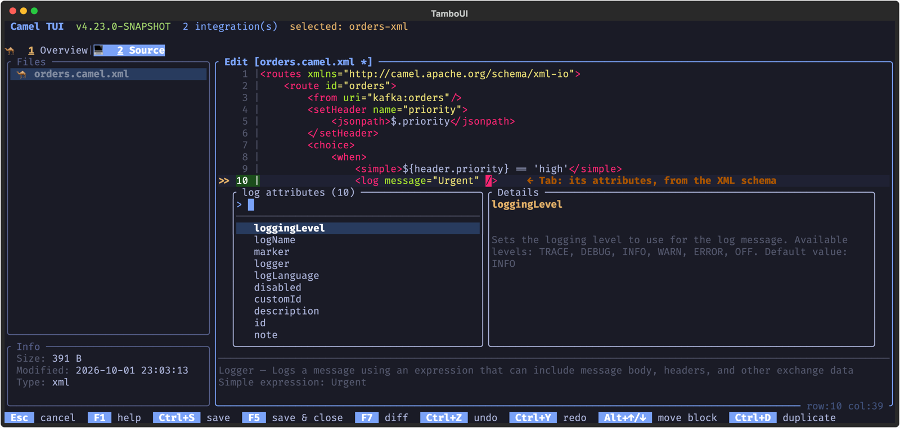

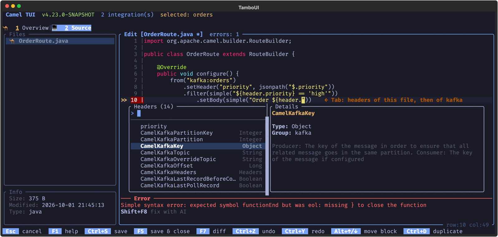

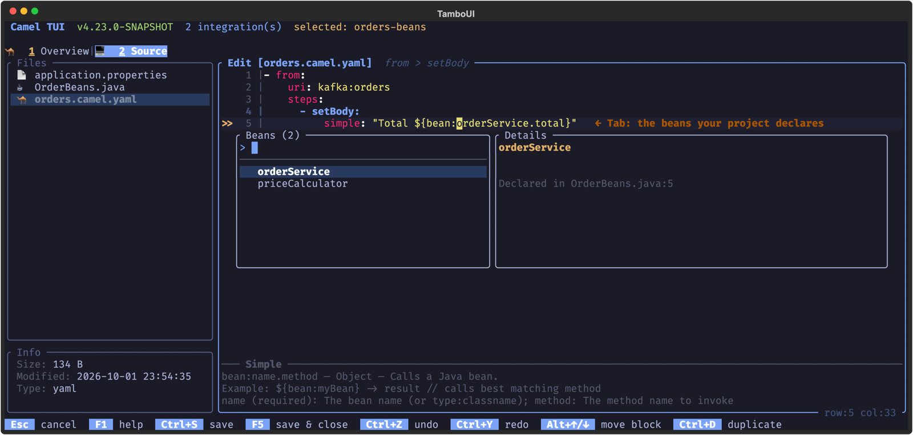

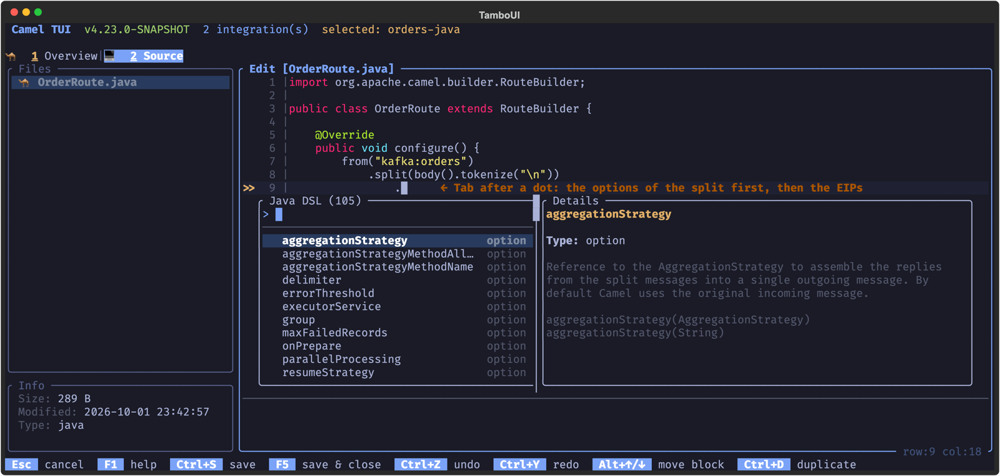

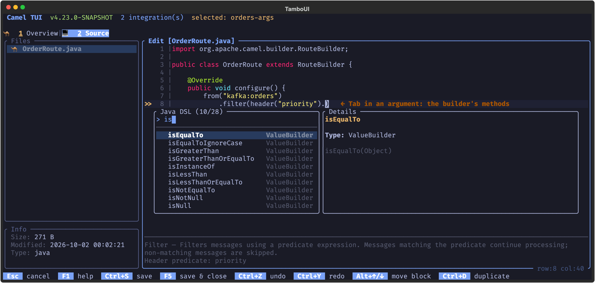

### Known limitations

**Tab** completion is light assistance for smaller, hand-written edits. It reads the line you are on and the text above the cursor, so it keeps working while the file is half typed, but it is no compiler and does not know the whole project:

-   **Java routes** — the chain is followed from what a route builder starts it with (`from(…​)`, `onException(…​)`, `rest(…​)`, `routeTemplate(…​)`, or `body()`, `header(..)`…​ in an argument). A route kept in a variable (`RouteDefinition route = from(…​); route.`), the code of lambdas and processors, the fluent language builders (`expression().jsonpath()…​`), and your own builder methods get no completion. The methods come from the Camel version of the TUI, their documentation from the catalog of your project. Deprecated methods are not offered.
    
-   **XML routes** — the routes of the XML DSL (`camel-xml-io`); the wrapper elements of Spring XML are not completed. Values are completed for options with a fixed set of values (enums, `true`/`false`) and `{{placeholders}}`.
    
-   **Simple expressions** — header, property and variable names are the ones the file sets or reads and the headers of the components it uses, not the ones other routes or your own code set at runtime.
    
-   Nothing is completed from your own Java classes and beans, and there are no imports or refactorings beyond the **Ctrl+R** menu (no rename, and no extract to file in Java, whose steps are no block with clear edges).
    

For more than that, an AI coding agent is the more powerful companion: working together with you in the TUI, it knows Camel, reads and writes the whole project, runs the routes and checks them, and explains what it does as it goes. See [the AI panel](camel-jbang-tui-ai.md) to ask about and change your routes from the TUI, and [using a coding agent](camel-jbang-tui-ai-agents.html#_using_a_coding_agent_acp) to work in the TUI with any coding agent that speaks the Agent Client Protocol (ACP); Claude Code, Codex and opencode are some known to work.

## Quick Documentation

The panel at the bottom shows the documentation of the line the cursor is on, from the Camel catalog: the component and the options of an endpoint, the EIP of a step, or the language of an expression.

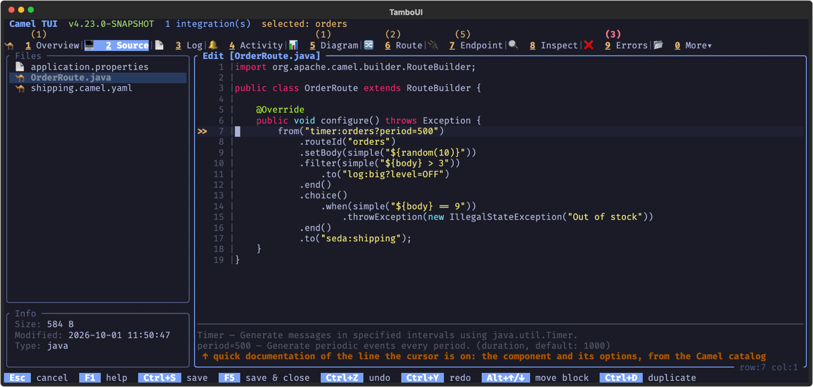

This makes an unfamiliar route easy to read without leaving the terminal.

What the project knows about the line comes first. A property placeholder shows its value, from the `.properties` files of the project, or the default that is used when it is not set:

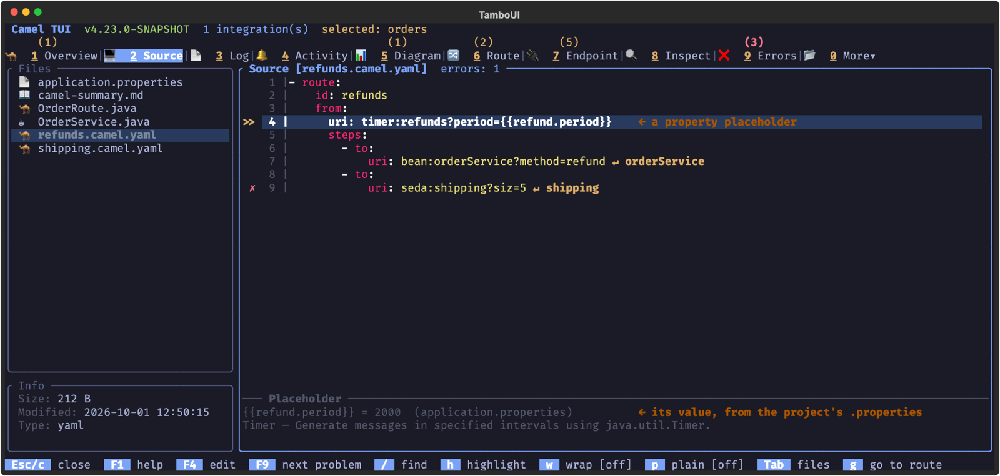

A line that refers to a bean (`bean:name`, `.bean(MyBean.class)`, `ref: name`, `#class:com.foo.MyBean`…​) says where the project declares it (`@BindToRegistry`, `@Named`, `@Component`, `@Bean`, or the beans of a YAML or XML file), and shows a `↵ name` jump link: **Enter** goes to the declaration.

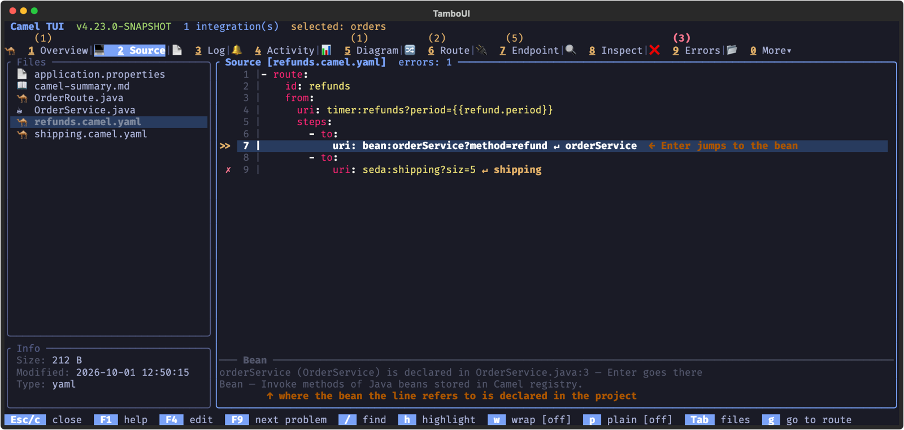

In a [Simple](../components/4.22.x/languages/simple-language.md) expression, the panel follows the cursor within the line: on a function it shows what the function is, an example and its parameters; on `${header.priority}` the header too (set in this file, or the description of a component header such as `CamelKafkaKey`); on an operator after a function, such as `contains`, the operator and its syntax. Elsewhere on the line it shows the documentation of the line as usual, and outside edit mode the line lists the functions it uses.

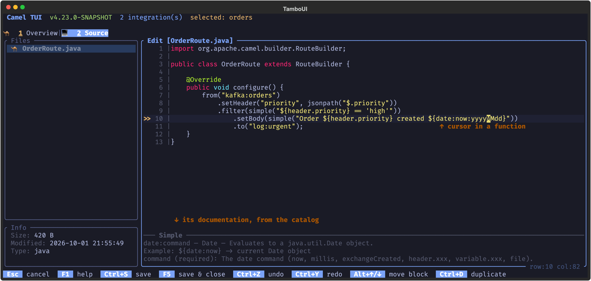

In an XML route the panel also follows the cursor: on an attribute name or in its value it shows that attribute (its documentation, default and values), on an element name the element and its required attributes. The `uri` attribute keeps the documentation of its endpoint.

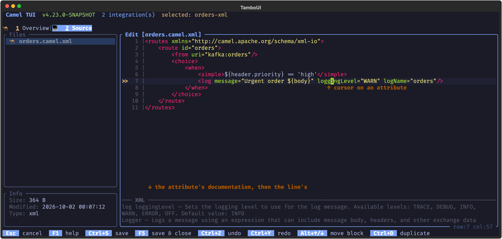

## Navigation

-   **Jump links** — a line that sends to another route, such as `to("seda:shipping")`, shows `↵ shipping`. Press **Enter** on the line to go to that route, also when it is in another file or another DSL. A `from` shows which route calls it.
    
-   **Go to route** — **g** lists all the routes of the project; type to filter, and **Enter** opens the route.
    
-   **Bean jumps** — a line that refers to a bean shows `↵ name`, and **Enter** goes to where the project declares it.
    
-   **Usages** — **u** on a line with an endpoint lists where it is used: the routes that consume from it and the steps that send to it, across the project and its DSLs. **Enter** goes there.
    
-   **Go to node** — **Ctrl+G** shows the routes of the YAML, Java and XML files and their processors as a tree (the `when` and `otherwise` of a choice included). Type to filter by route ID, EIP or label, or type a line number, and **Enter** jumps there.
    
-   **Search** — **/** searches the source, **n**/**N** go to the next and previous match, and **h** highlights a text.
    

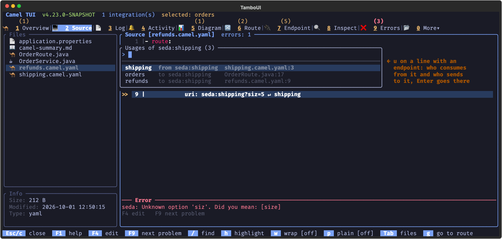

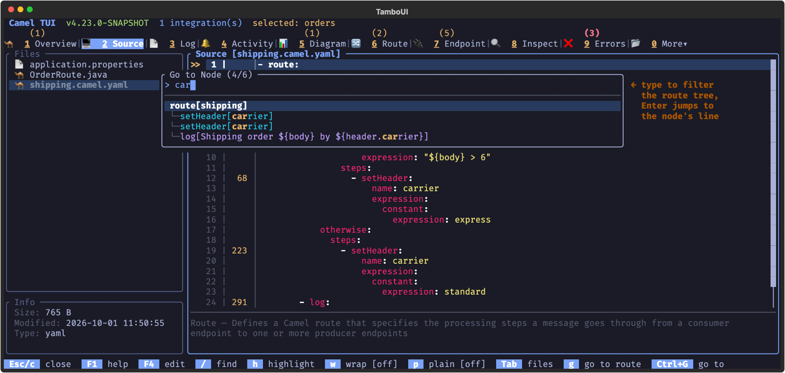

In a YAML route, the title shows where the cursor is in the route, such as `route > from > choice > when > setHeader`:

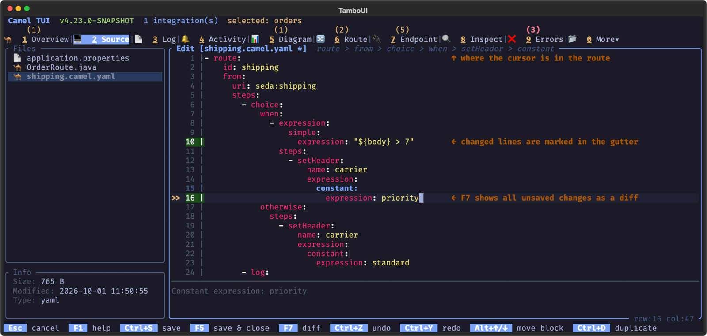

## Changes and Diff

The line numbers of the lines you changed since the file was opened are green (see the picture above), so you see at a glance what you changed. **F7** shows all the unsaved changes as a diff, with the line numbers of the file. **F7** or **Esc** returns to the editor.

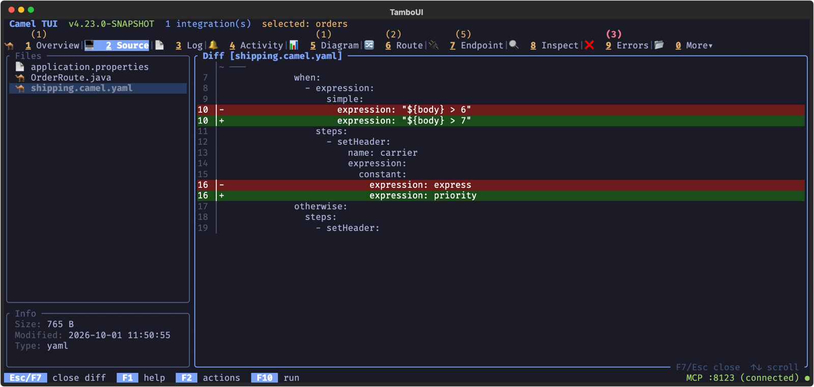

## YAML, Java and XML

When you open the source of a route from the Diagram or Route tab (**c**), **Space** shows that route in YAML, Java or XML. The title shows the three formats, and the one marked with `*` is the file the route is written in.

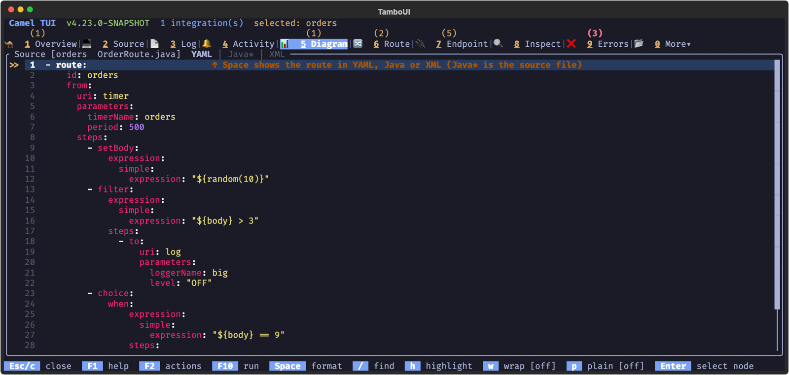

This is handy to see how a route reads in another DSL, or to copy it into a file of another DSL. Press **p** for plain mode, which hides the line numbers and borders for easy copying.

To convert a whole file, select it in the file list, press **F12** and pick _Convert to YAML_, _Convert to XML_ or _Convert to Java_. This works on files at rest, without running them: the file is read into the model (the beans of a YAML file as definitions, not created), written in the other DSL into a new file next to it (`orders.camel.xml` becomes `orders.camel.yaml`, or the route builder class `Orders.java`), and read back to check it has the same routes. The new file opens; the original stays as it is, and an existing file is not overwritten. What does not carry over is said at the top of the new file, such as the comments or a part the other DSL’s writer leaves out, and a file that would lose something it cannot say (a lambda processor, a predicate built in Java code) is not converted, with the reason why.

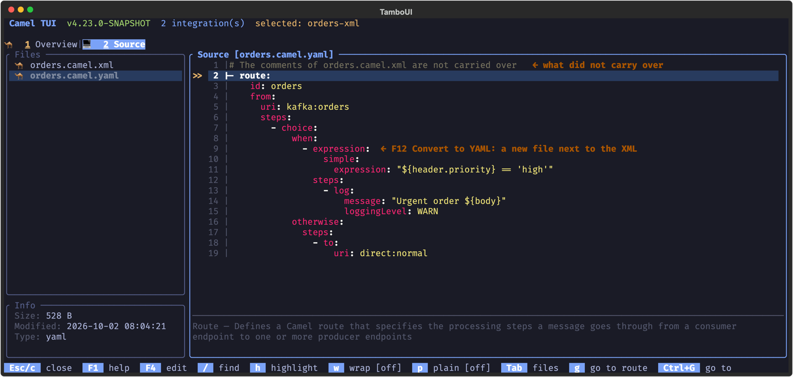

## Keyboard Shortcuts

### Viewing

 
| Key | Action |
| --- | --- |
| **Up/Down** | Navigate files (left panel) or scroll source (right panel) |
| **Enter** | Open file or directory; on a jump link, go to the linked route or bean |
| **Backspace** | Go to parent directory |
| **Tab** | Toggle focus between file list and source viewer |
| **F12** | File actions (new file, new folder, rename, duplicate, delete, copy path) |
| **Space** | Cycle format (YAML/Java/XML), when the source of a route is shown |
| **/** | Search in source |
| **h** | Highlight text |
| **n** / **N** | Next / previous search match |
| **w** | Toggle word wrap |
| **p** | Toggle plain mode (borderless) |
| **g** | Go to route |
| **Ctrl+G** | Go to node or line |
| **u** | Usages of the endpoint of the line |
| **F9** | Next problem |
| **Esc** / **c** | Close source viewer |
| **F4** | Enter edit mode |

### Editing

 
| Key | Action |
| --- | --- |
| **Tab** | Completion |
| **Ctrl+Z** | Undo |
| **Ctrl+Y** | Redo |
| **Alt+Up/Down** | Move YAML block up/down |
| **Ctrl+D** | Duplicate block |
| **Ctrl+K** | Delete current line |
| **Ctrl+Left/Right** | Word navigation |
| **Home** | Smart home (content indent / column 0) |
| **Ctrl+R** | Refactoring menu: replace URI, extract to property, extract a step to a new file (YAML, XML) |
| **F9** | Next problem |
| **Shift+F9** | Apply the quick fix of the problem on the line |
| **Shift+F8** | Ask the AI to fix the problem on the line |
| **F7** | Diff view (unsaved changes) |
| **Ctrl+S** | Save and continue editing |
| **F5** | Save and close |
| **Esc** | Cancel (asks before it discards unsaved changes) |