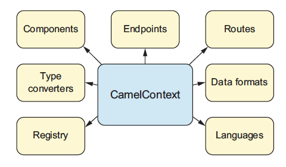
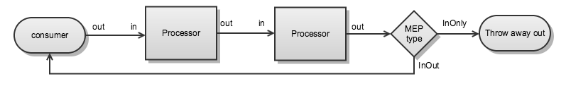
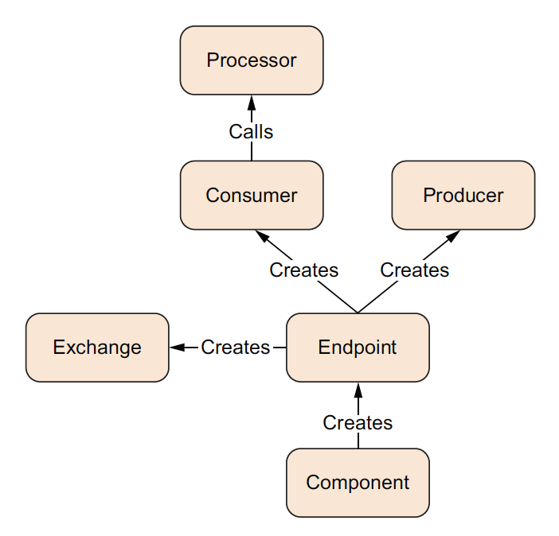
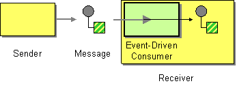

# CamelContext

The [`CamelContext`](https://www.javadoc.io/doc/org.apache.camel/camel-api/latest/org/apache/camel/CamelContext.md) is the runtime system, which holds together all the fundamental concepts of Apache Camel (routes, endpoints, components, etc).

This context object represents the Camel runtime system. Typically, you have one `CamelContext` instance in an application.



The `CamelContext` provides access to many features and services, the most notable being components, type converters, a registry, endpoints, routes, data formats, and languages.

The following table lists the most common services provided by the `CamelContext`:

 
| Service | Description |
| --- | --- |
| [Components](component.md) | Contains the components used. |
| [Endpoints](endpoint.md) | Contains the endpoints that have been used. |
| [Routes](routes.md) | The routes in use. |
| [Data formats](data-format.md) | Contains the loaded data formats. |
| [Languages](languages.md) | Contains the loaded languages. |
| [Type converters](type-converter.md) | Contains the loaded type converters. Camel has a mechanism that allows you to manually or automatically convert from one type to another. |
| [Registry](registry.md) | Contains a registry that allows you to look up beans. |

## CamelContext 101

To give you a better understanding of Apache Camel, we’ll discuss what is inside the `CamelContext`.

### Routing Engine

Camel’s routing engine moves messages under the hood and does all the heavy lifting to ensure that messages are routed properly. It is not exposed to the developer, but you should be aware that it’s there.

### Routes

[Routes](routes.md) are a core abstraction for Camel. The simplest way to define a route is as a chain of [Processors](processor.md). There are many reasons for using routers in messaging applications. By decoupling clients from servers, and producers from consumers, routes can, for example, do the following:

-   Decide dynamically what server a client will invoke
    
-   Provide a flexible way to add extra processing
    
-   Allow independent development for clients and servers
    
-   Foster better design practices by connecting disparate systems that do one thing well
    
-   Allow for clients of servers to be stubbed out (using [mocks](../components/4.18.x/mock-component.md)) for testing purposes
    

Each route in Camel has a unique identifier. You can use the identifier to log, debug, monitor, and start and stop routes.

Routes have one and only one input source for messages. They are effectively tied to an input endpoint.

### Domain Specific Language (DSL)

To wire processors and endpoints together to form routes, Camel defines a [DSL](dsl.md).

In Camel with Java, DSL means a fluent Java API that contains methods named for EIP terms. Camel provides multiple DSL languages. You could define the same route using the XML and YAML DSL as well.

Here, in a single Java statement, you define a route that consumes files from a [file](../components/4.18.x/file-component.md) endpoint. Camel uses the [Filter EIP](../components/4.18.x/eips/filter-eip.md) to route the messages using an XPath predicate to test whether the message is not a test order. If a message passes the test, Camel forwards it to the [JMS](../components/4.18.x/jms-component.md) endpoint. Messages failing the filter test are skipped.

-   Java
    
-   XML
    
-   YAML
    

```java
from("file:data/inbox")
    .filter().xpath("/order[not(@test)]")
        .to("jms:queue:order");
```

```xml
<route>
    <from uri="file:data/inbox"/>
    <filter>
        <xpath>/order[not(@test)]</xpath>
        <to uri="jms:queue:order"/>
    </filter>
</route>
```

```yaml
- route:
    from:
      uri: file:data/inbox
      steps:
        - filter:
            expression:
              xpath:
                expression: "/order[not(@test)]"
            steps:
              - to:
                  uri: jms:queue:order
```

The DSLs provide a nice abstraction for Camel users to build applications. Under the hood, though, a route is composed of a graph of processors.

### Processors

The [processor](processor.md) is a core Camel concept that represents a node capable of using, creating, or modifying an incoming [exchange](exchange.md).

During routing, exchanges flow from one processor to another; as such, you can think of a route as a graph having specialized processors as the nodes, and lines that connect the output of one processor to the input of another. Processors could be implementations of EIPs, producers for specific components, or your own custom code. The figure below shows the flow between processors.



A route starts with a consumer (i.e., `from` in the DSL) that populates the initial [exchange](exchange.md). At each processor step, the output (out) message from the previous step is the input (in) message of the next. In many cases, processors don’t set an out message, so in this case the in message is reused. The [exchange pattern](exchange-pattern.md) of the exchange determines, at the end of a route, whether a reply needs to be sent back to the caller of the route. If the exchange pattern (MEP) is `InOnly`, no reply will be sent back. If it’s `InOut`, Camel will take the out message from the last step and return it.

### Component

[Components](../components/4.18.x/index.md) are the main extension point in Camel.

From a programming point of view, components are fairly simple: they’re associated with a name that’s used in a [URI](uris.md), and they act as a factory of [endpoints](endpoint.md).

For example, `FileComponent` is referred to by file in a URI, and it creates `FileEndpoint`. The endpoint is perhaps an even more fundamental concept in Camel.

### Endpoint

An [endpoint](endpoint.md) is the Camel abstraction that models the end of a channel through which a system can send or receive messages.


In Camel, you configure endpoints by using URIs, such as `file:data/inbox?delay=5000`, and you also refer to endpoints this way. At runtime, Camel looks up an endpoint based on the URI notation. The figure below shows how this works.


The scheme (1) denotes which Camel component handles that type of endpoint. In this case, the scheme of `file` selects `FileComponent`. `FileComponent` then works as a factory, creating `FileEndpoint` based on the remaining parts of the URI. The context path `data/inbox` (2) tells `FileComponent` that the starting folder is `data/inbox`. The option, `delay=5000` (3) indicates that files should be polled at a 5-second interval.

The next figure shows how an endpoint works together with an exchange, producers, and consumers.



An endpoint acts as a factory for creating consumers and producers that are capable of receiving and sending messages to a particular endpoint.

### Producer

A producer is the Camel abstraction that refers to an entity capable of sending a message to an endpoint. When a message is sent to an endpoint, the producer handles the details of getting the message data compatible with that particular endpoint. For example, `FileProducer` will write the message body to a `java.io.File`. `JmsProducer`, on the other hand, will map the Camel message to `javax.jms.Message` before sending it to a JMS destination. This is an important feature in Camel, because it hides the complexity of interacting with particular transports. All you need to do is route a message to an endpoint, and the producer does the heavy lifting.

### Consumer

A consumer is the service that receives messages produced by some external system, wraps them in an [exchange](exchange.md), and sends them to be processed. Consumers are the source of the exchanges being routed in Apache Camel. To create a new exchange, a consumer will use the endpoint that wraps the payload being consumed. A [processor](processor.md) is then used to initiate the routing of the exchange in Camel via the routing engine.

Camel has two kinds of consumers: event-driven consumers, and polling consumers (or scheduled polling consumers). The differences between these consumers are important, because they help solve different problems.

#### Event Driven Consumer

The most familiar consumer is the event-driven consumer, as illustrated:



This kind of consumer is mostly associated with client-server architectures and web services. It’s also referred to as an asynchronous receiver in the EIP world. An event-driven consumer listens on a particular messaging channel, such as a TCP/IP port, JMS queue, Twitter handle, Amazon SQS queue, WebSocket, and so on. It then waits for a client to send messages to it. When a message arrives, the consumer wakes up and takes the message for processing.

#### Polling Consumer / Scheduled Polling Consumer

In contrast to the event-driven consumer, the polling consumer actively goes and fetches messages from a particular source, such as an FTP server. The polling consumer is also known as a synchronous receiver in EIP lingo, because it won’t poll for more messages until it’s finished processing the current message. A common flavor of the polling consumer is the scheduled polling consumer, which polls at scheduled intervals. File, FTP, and email components all use scheduled polling consumers.

> **Note**
> In the Camel components, its only either the event driven or scheduled polling consumers that are in use. The polling consumer (non-scheduled) is only used to poll on-demand, such as when using the [Poll Enrich](../components/4.18.x/eips/pollEnrich-eip.md) EIP, or from Java by creating a `PollingConsumer` instance via the `createPollingConsumer()` method from `Endpoint`.

## See Also

See the following for high-level [architecture](architecture.md) of Apache Camel.

See [Lifecycle](lifecycle.md) to understand the overall lifecycle of the `CamelContext`.