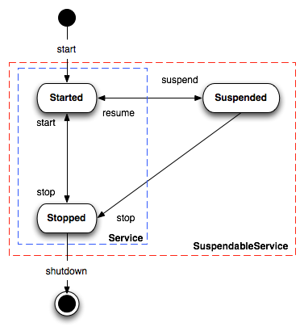

# Camel Lifecycle

Camel uses a simple _lifecycle_ interface called [Service](https://www.javadoc.io/doc/org.apache.camel/camel-api/current/org/apache/camel/Service.md) which has `start()` and `stop()` methods.

Many of Camel’s classes implement `Service` such as `CamelContext` along with all `Component` and `Endpoint` classes.

When you use Camel you typically have to start the `CamelContext` which will start all the various components and endpoints and activate the routing rules until the context is stopped again.

## CamelContext Lifecycle

The `CamelContext` provides methods to control its lifecycle:

-   `build`
    
-   `init`
    
-   `start`
    
-   `stop`
    
-   `suspend`
    
-   `resume`
    
-   `shutdown`
    

The operations are paired: start/stop and suspend/resume.

Stop is performing a [Graceful Shutdown](graceful-shutdown.md) which means all its internal state, cache, etc is cleared; and the routes is being stopped in a graceful manner to ensure messages are given time to complete.

Shutdown is the last phase when Camel is shutting down. After shutdown then Camel cannot be started again. The shutdown happens automatic when a JVM is terminating, such as Spring Boot applications that has been signalled to terminate.

> **Important**
> If you start a `CamelContext` after a stop, then its performing a _cold_ start, recreating all the state, cache etc. again; which is not guaranteed to startup correctly again. Instead, you can use the suspend/resume operations. They will keep the `CamelContext` _warm_ and only suspend/stop routes using the same [Graceful Shutdown](graceful-shutdown.md) feature. This ensures messages are given time to complete.

End users is encouraged to use suspend/resume if you are temporary stopping a Camel application.

All these operations are available in JMX as well, so you can control Camel from JMX management.

## Service lifecycle

A service (`org.apache.camel.Service`) in Camel adheres to the following lifecycle states as illustrated in the diagram below:

The `org.apache.camel.support.service.ServiceSupport` is a good base class to extend for custom services as it offers the basic functionally to keep track of state. You implement your custom logic in the `doStart`, `doStop`, `doSuspend`, `doResume` methods.

> **Tip**
> A service can optimally support suspend/resume by the `org.apache.camel.SuspendableService`. This means not all services in Camel supports suspension. It’s encouraged that consumers support suspension which allows suspending/resuming routes.

## Startup Lifecycle

When Camel startup there are various listeners that can be used to plugin custom code, that can listen and react during startup such as `LifecycleStrategy`, or `MainListener`.

If you need Camel to check for _something_ before it can start up, then look at [Startup Condition](startup-condition.md)